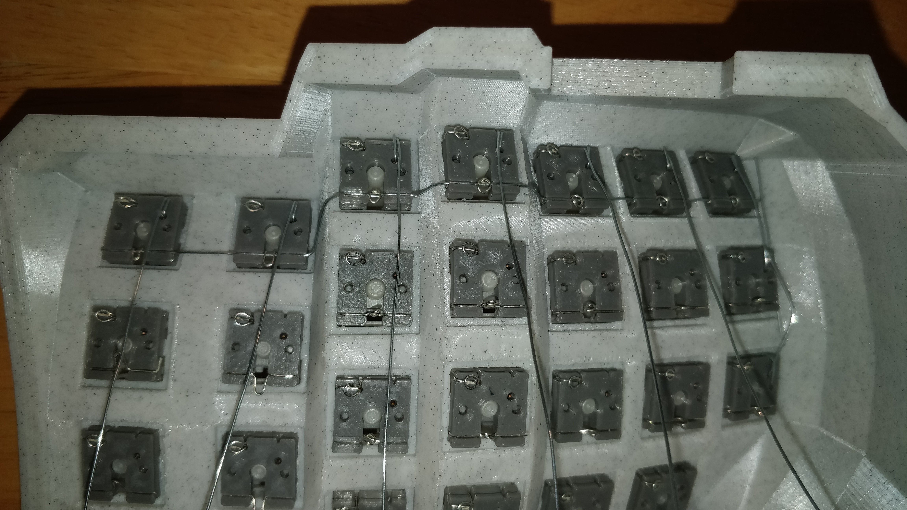
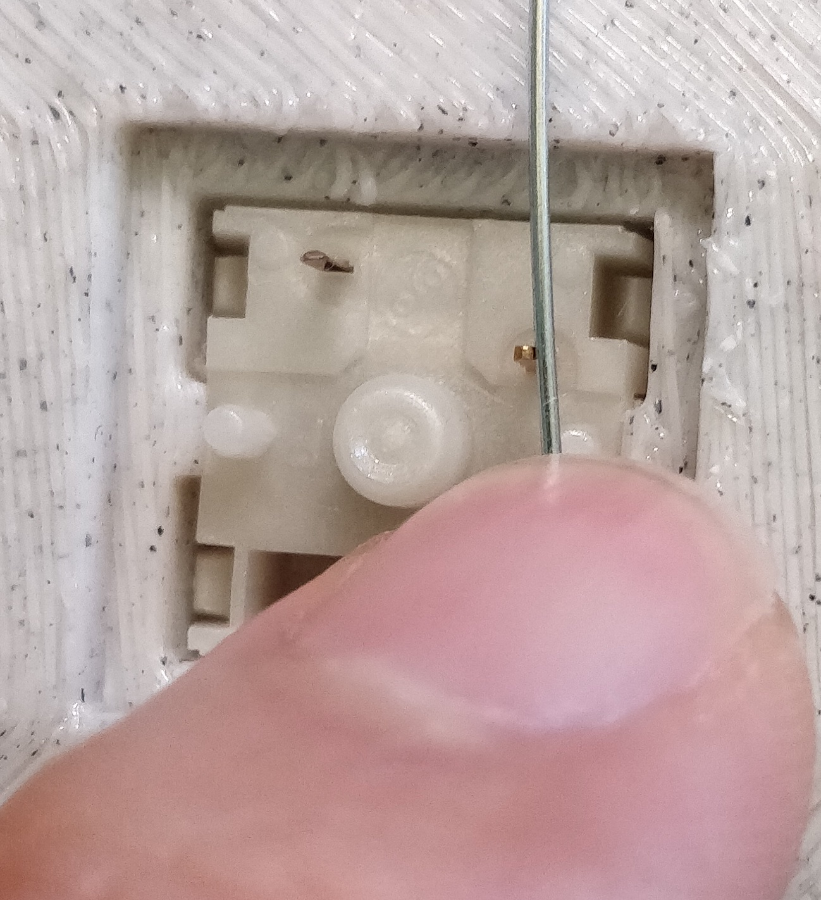
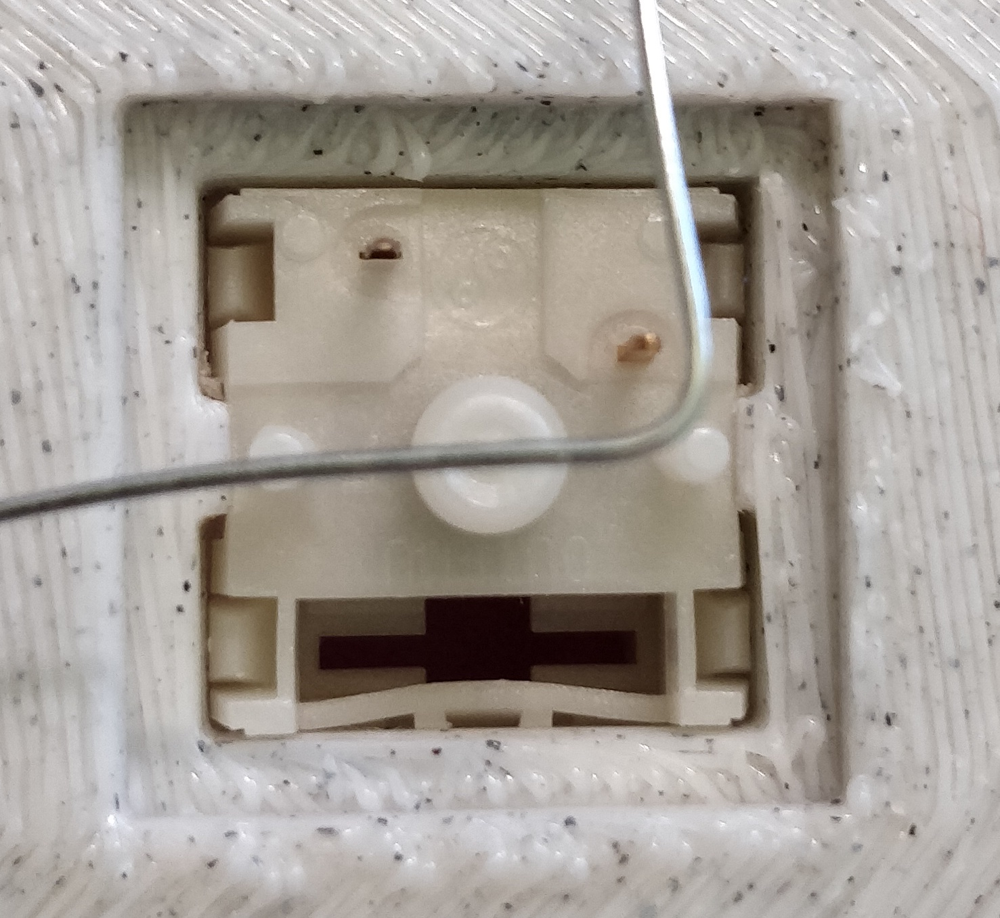
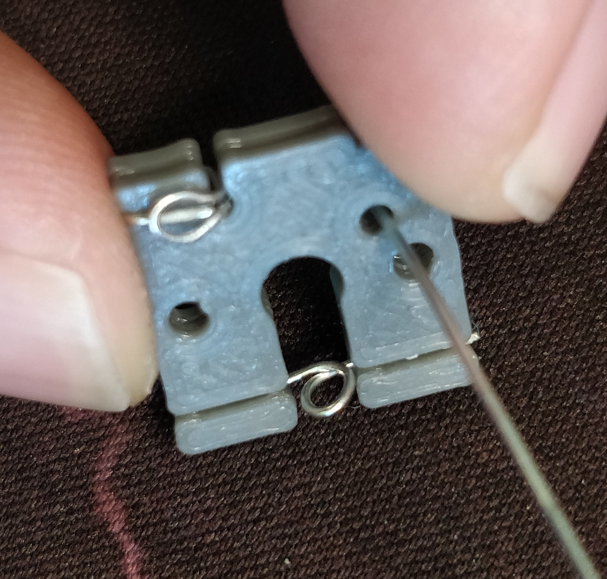
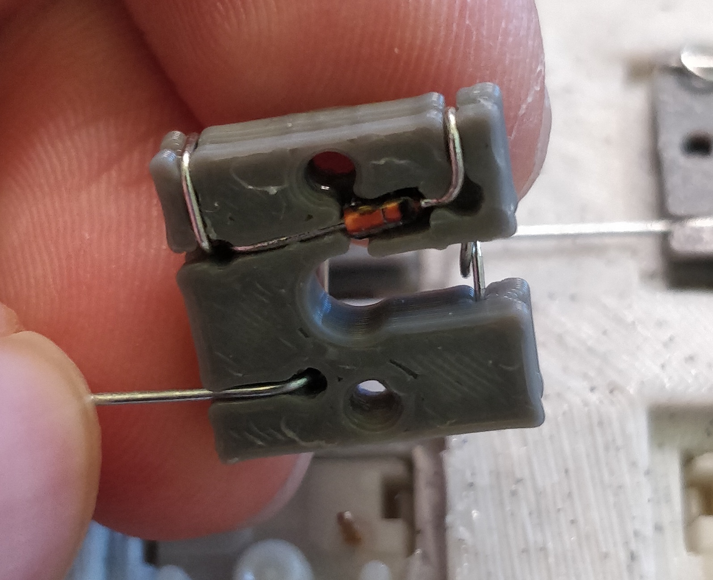
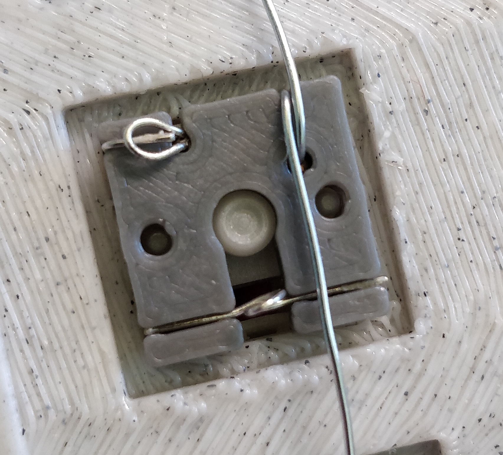
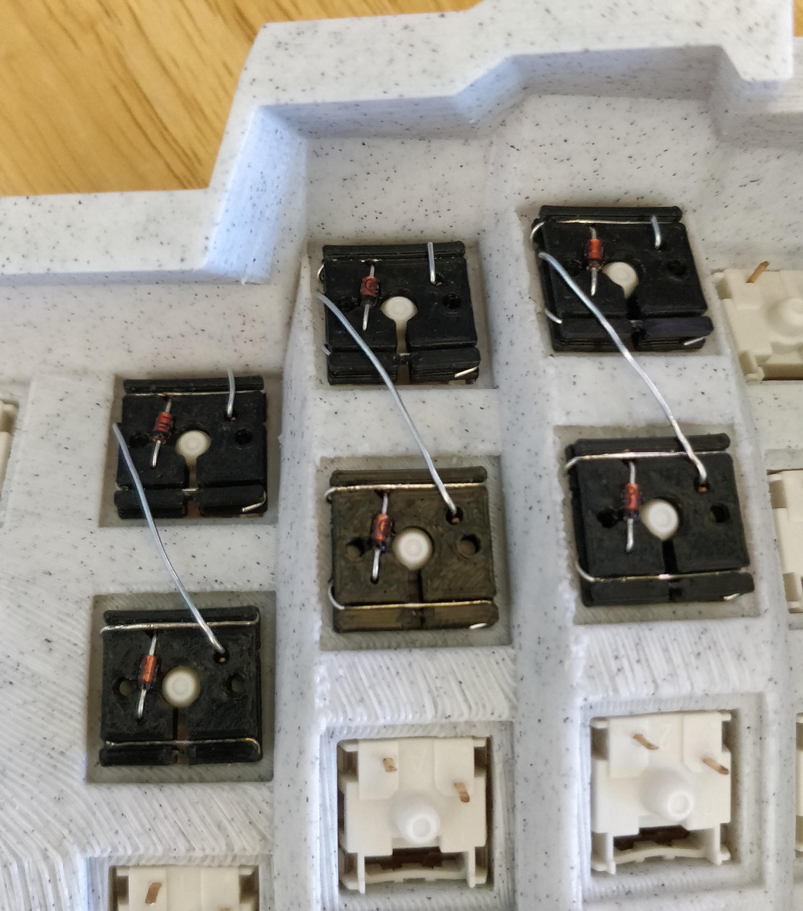
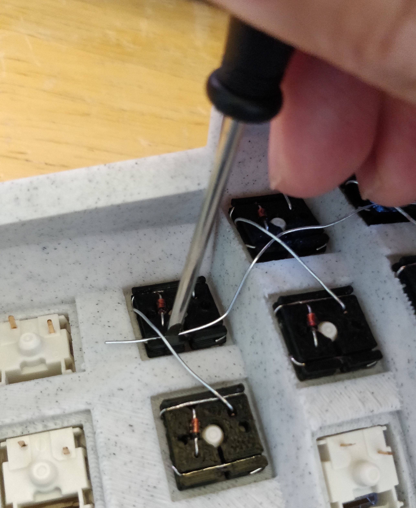
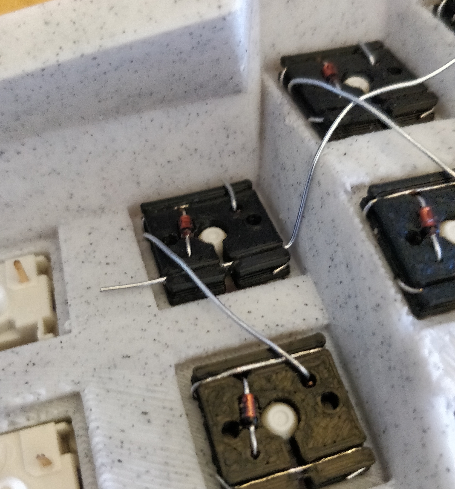

# Building the Matrix

The best way to make the matrix is to alternate wiring columns and rows, weaving the matrix together one row at a time.

In this picture, I just did the first column wire connections for the first row of sockets. I then connected all the sockets together using a single row wire. The next step would be to do the column connections of the second row of sockets.

## Columns

We need to make a 90 degree bend near the right pin. A good rule of thumb (oops) is to make the bend at the switch pin

Thread the column wire into the top face of the socket, in the appropriate hole

Seat the 90 degree bend in the wire channel

Make 2x 90 degree bends around the body, locking the socket body into the wire loop. This is also a great place to drop a bead of solder to permanently hold the matrix together 

## Rows

Wire up the columns as per the above instructions

Snake a length of solid core wire across the entire row, making sure to cross UNDER the column wires. The difficulty of this will depend on how weird your board is and how tightly you wired the columns. If you use the weaving method as suggested at the top of this README, this step should be easy

Position the wire over the bottom wire channel

Stab the wire into the channel using a flathead screwdriver or fingernails

Position the wire

Stab the wire in. Position the next wire

Stab the wire in

Fold the loop of wire in the gap over the row wire to form a secure connection. This is also a great place to drop a bit of solder for a permanent connection.

