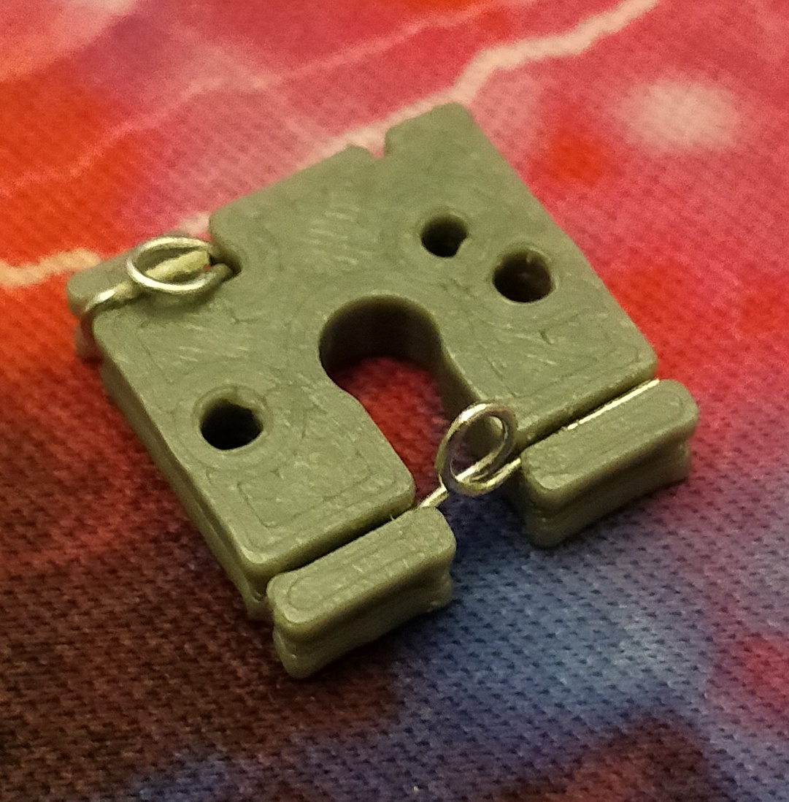

# handwirehotswap
A 3D printed, Solderless Hot Swap Socket to build keyswitch matrixes

Link to the original Thingiverse Post: https://www.thingiverse.com/thing:4791318

Hop into the "Matrix" or "Socket" folders for photo guided assembly instructions

## v4 is out!

**Orientation of the STL file is not correct. Print this with diode slot facing up**

v4 brings significant improvements, including:
- Easier to print
  - Important dimensions are now printed on the top face, reducing problems caused by first layer horizontal expansion
  - Much easier to press the switch into the socket now
- Improved robustness of row wire connection
  - Row wire can now be clamped down onto the diode wire
- Faster to assemble / put in diode
  - Less precision required, more brute force expected
- Better method of connecting pin and diode
  - v3 had a nasty tendency to crush the upper switch pin, especially considering the amount of force required to put the switch into a v3 socket.
  - New design has an escape path for the pin if misaligned, and a better way of making electrical connection overall.

## Other hardware notes

Diode Legs: 25 SWG
Solid Core Wire: 24 SWG

24 SWG is ~0.558mm diameter, anything around .5mm dia should work fine.

If thicker solid core wire is used, it is advised to go into the code and adjust the size of the row wire channel and column pin hole. Thingiverse Customizer might also work but I have not tested it much.